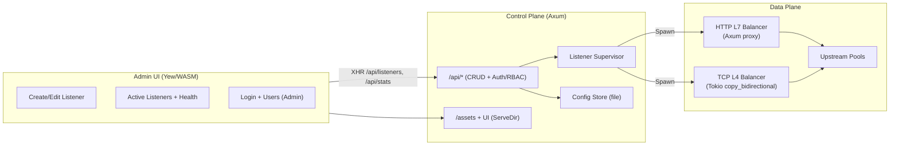

# Balor

Rust-native L4/L7 load balancer with an Axum admin API and a Yew (WASM) control panel.

<p align="center">
  
</p>

**Author:** Eduard Gevorkyan (egevorky@arencloud.com)  
**License:** Apache 2.0

## Architecture



- **Backend (`backend`)**: Axum HTTP server exposing CRUD APIs for listeners and serving the compiled admin UI. A supervisor spawns runtime tasks per listener:
  - **HTTP (L7)**: Axum fallback proxy with round-robin upstream selection and header sanitization.
  - **TCP (L4)**: Tokio `copy_bidirectional` bridge with round-robin upstream selection.
- **Admin UI (`admin`)**: Yew single-page app compiled to WASM via Trunk. Provides listener creation, editing, deletion, and live stats against `/api/*`. Uses the logo at `images/balor.png`.
- **Workspace**: Cargo workspace rooted at repository top; shared dependencies declared in the workspace `[dependencies]`.

## Run the control plane
Prerequisites: Rust toolchain, `wasm32-unknown-unknown` target, and `trunk` for the UI (`cargo install trunk`).

```bash
# Build the admin UI to admin/dist
cd admin
trunk build --release

# Run the backend (serves API + UI)
cargo run -p backend
# Admin UI available at http://127.0.0.1:8080
```

Environment knobs:
- `BALOR_HTTP_ADDR` (default `0.0.0.0:8080`) – admin API + UI bind address.
- `BALOR_ADMIN_DIST` (default `admin/dist`) – path where the Yew assets are served from.
- `BALOR_STATE_FILE` (default `data/balor_state.json`) – persisted listener config storage.
- `BALOR_DEFAULT_ADMIN_PASSWORD` (default `admin`) – bootstrap password for the auto-created `admin` user if no users exist.
- `BALOR_ADMIN_TOKEN` (optional) – alternative bearer token that always maps to `admin` role (bypasses password).

## API sketch
- `GET /api/health` – service heartbeat.
- `GET /api/stats` – listener/task counts.
- `GET /api/listeners` – list configured listeners.
- `POST /api/listeners` – create listener with `{ name, listen, protocol: "http"|"tcp", upstreams: [{ name, address, enabled }] }`.
- `GET /api/listeners/{id}` – fetch a listener.
- `PUT /api/listeners/{id}` – update a listener.
- `DELETE /api/listeners/{id}` – remove a listener and stop its runtime.
- `POST /api/login` / `POST /api/logout` – session tokens for the UI.
- `GET/POST/PUT/DELETE /api/users` – RBAC user management (admin only).

## Notes
- HTTP upstream addresses should include scheme (e.g., `http://127.0.0.1:7000`). TCP upstreams use host:port.
- State persists to `data/balor_state.json` on each change (path override via `BALOR_STATE_FILE`).
- Background health checks run every ~5 seconds and mark upstreams up/down in the UI automatically.
- HTTP listeners can terminate TLS via PEM cert/key paths; files are reloaded when they change.
- Sticky sessions supported per HTTP listener (cookie or client IP hash).
- RBAC roles: Admin (full), Operator (CRUD listeners), Viewer (read-only).
- The UI defaults to a sample listen address (`0.0.0.0:9000`) and a single upstream; adjust per environment.
