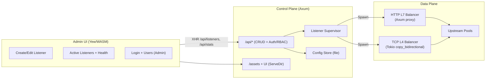

# Balor

Rust-native L4/L7 load balancer with an Axum admin API and a Yew (WASM) control panel.

<p align="center">
  
</p>

**Author:** Eduard Gevorkyan (egevorky@arencloud.com)  
**License:** Apache 2.0

## Architecture



- **Backend (`backend`)**: Axum HTTP server exposing CRUD APIs for listeners and serving the compiled admin UI. A supervisor spawns runtime tasks per listener:
  - **HTTP (L7)**: Axum fallback proxy with round-robin upstream selection and header sanitization. Host-based routing is first-class: each host binds to an upstream pool and can carry its own TLS/ACME settings (SNI).
  - **TCP (L4)**: Tokio `copy_bidirectional` bridge with round-robin upstream selection. TCP listeners now reuse upstream pools (pick a pool; the UI hydrates endpoints automatically).
- **Admin UI (`admin`)**: Yew single-page app compiled to WASM via Trunk. Provides listener creation, editing, deletion, and live stats against `/api/*`. Uses the logo at `images/balor.png`.
- **Workspace**: Cargo workspace rooted at repository top; shared dependencies declared in the workspace `[dependencies]`.

## Run the control plane
Prerequisites: Rust toolchain, `wasm32-unknown-unknown` target, and `trunk` for the UI (`cargo install trunk`).

```bash
# Build the admin UI to admin/dist
cd admin
trunk build --release

# Run the backend (serves API + UI)
cargo run -p backend
# Admin UI available at http://127.0.0.1:8080
```

Environment knobs:
- `BALOR_HTTP_ADDR` (default `0.0.0.0:8080`) – admin API + UI bind address.
- `BALOR_ADMIN_DIST` (default `admin/dist`) – path where the Yew assets are served from.
- `BALOR_STATE_FILE` (default `data/balor_state.json`) – persisted listener config storage.
- `BALOR_DEFAULT_ADMIN_PASSWORD` (default `admin`) – bootstrap password for the auto-created `admin` user if no users exist.
- `BALOR_ADMIN_TOKEN` (optional) – alternative bearer token that always maps to `admin` role (bypasses password).

## API sketch
- `GET /api/health` – service heartbeat.
- `GET /api/stats` – listener/task counts.
- `GET /api/listeners` – list configured listeners.
- `POST /api/listeners` – create listener. HTTP listeners rely on host-based routes: `{ name, listen, protocol: "http", host_routes: [{ host, pool, tls?, acme? }], upstreams: [...] }` (TCP uses `upstreams`, typically hydrated from a selected pool in the UI). Pools are referenced by name.
- `GET /api/listeners/{id}` – fetch a listener.
- `PUT /api/listeners/{id}` – update a listener.
- `DELETE /api/listeners/{id}` – remove a listener and stop its runtime.
- `GET/POST/DELETE /api/pools` – manage reusable upstream pools (attach to host routes).
- `POST /api/login` / `POST /api/logout` – session tokens for the UI.
- `GET/POST/PUT/DELETE /api/users` – RBAC user management (admin only).

## Notes
- HTTP upstream addresses should include scheme (e.g., `http://127.0.0.1:7000`). TCP upstreams use host:port. HTTP host routes pick from pools (pool selection is required per host); TCP listeners select a pool and the UI fills endpoints for you.
- State persists to `data/balor_state.json` on each change (path override via `BALOR_STATE_FILE`).
- Background health checks run every ~5 seconds and mark upstreams up/down in the UI automatically.
- HTTP listeners can terminate TLS via PEM cert/key paths; files are reloaded when they change. Multiple certificates on one port are supported via per-host SNI selection; a listener-level certificate acts as fallback.
- Sticky sessions supported per HTTP listener (cookie or client IP hash).
- Upstream `Set-Cookie` domains are rewritten to the client-facing host to keep sessions alive across refreshes when proxied.
- RBAC roles: Admin (full), Operator (CRUD listeners), Viewer (read-only).
- Prometheus metrics exposed at `/metrics` (HTTP counters/latency and TCP connection totals per listener).
- WebSocket pass-through supported for HTTP listeners (upgrade + bidirectional frames).
- ACME automation: HTTP-01 responder serves tokens from `BALOR_ACME_CHALLENGE_DIR` (default `data/acme-challenges`); HTTP-01 issuance now runs automatically for host routes that request ACME and stores PEMs under `data/certs`. DNS-01 flow uses provider profiles (Cloudflare, Route53, generic) in the Admin UI, but automation is still pending.
- Certificates dashboard: upload/download manual PEM bundles (stored under `BALOR_CERT_DIR`, default `data/certs`) from the Admin UI Certificates tab.
- ACME provider type auto-sets API base URLs (Cloudflare/Route53) with overrides allowed.
- The UI defaults to a sample listen address (`0.0.0.0:9000`) and a single upstream; adjust per environment.
- Browser support note: Chrome/Chromium and Firefox are both supported; Users/Metrics views were refactored to avoid the previous Firefox layout crash.

## Feature status (near-term)
- ✅ Persistent config store
- ✅ Health checks (HTTP/TCP)
- ✅ TLS termination (hot reload, per-host SNI)
- ✅ Sticky sessions (cookie/IP hash)
- ✅ RBAC (admin/operator/viewer)
- ✅ Metrics (Prometheus HTTP/TCP)
- ✅ Cookie rewrite to client host
- ✅ Host-based routing & SNI multi-cert
- ✅ Pools dashboard; listeners/pools reuse
- ✅ WebSocket pass-through
- ✅ Certificates dashboard (manual PEM upload/download; ACME-issued certs register)
- ✅ Version banner: UI/API/build version surfaced via `/api/version` and shown in the header
- ✅ Metrics tab now includes latency quantiles (p50/p95/p99) derived from Prometheus buckets with quick visual cards
- ⚠️ ACME automation: HTTP-01 + Cloudflare DNS-01 with periodic renewal; Route53/Generic DNS-01 and renewal/backoff polish pending
- ✅ Browser support: Chrome/Chromium and Firefox verified after Users/Metrics fixes
